# Continual VLA RL: Reproducing "A Simple Recipe Works" with SmolVLA

## Overview

We implement the continual reinforcement learning pipeline from [A Simple Recipe Works (arXiv:2603.11653)](https://arxiv.org/abs/2603.11653) using **SmolVLA** (500M params) on a simulated SO-100 robot arm in ManiSkill/SAPIEN.

**Recipe**: Pretrained VLA + LoRA (rank 32) + Sequential GRPO. No replay buffer, no regularization.

## Setup

- **Model**: SmolVLA (SmolVLM2-500M backbone + flow-matching action head), 17.3M / 467M trainable params (3.70% via LoRA)
- **Robot**: SO-100 6-DOF arm, simulated in SAPIEN with GPU backend
- **Tasks**: 8 "put X on plate" tasks (4 training, 4 held-out)
- **Demos**: 35 per task, 140 total (matching paper's demo count)
- **Hardware**: 1x NVIDIA RTX 4090 (24GB)

## Pipeline

### Phase 1: SFT Warm-up (5.9h)

Sequential supervised fine-tuning on all 4 training tasks using flow-matching loss.

- 100 epochs per task, lr=1e-4, batch_size=32 (micro_batch=4, accum=8)
- Uses `base_policy.forward()` for differentiable FM loss

### Phase 2: Sequential GRPO

On-policy RL with Group Relative Policy Optimization on the same 4 tasks sequentially.

- Flow-matching GRPO: `log p(a|s) ~ -E_t[||v_theta(x_t,t,s) - u_t||^2]`
- Clipped objective with asymmetric clip (0.20, 0.28)
- 1,024 episodes/task, 4 rollout epochs, 10 updates/task, ~21 min/update
- **Round 1**: 10 updates/task from SFT checkpoint (14.3h)
- **Round 2**: 10 more updates/task from Round 1 checkpoint (14.3h)
- **Total: 20 GRPO updates/task across 2 rounds**

**Total wall time: ~34h** (SFT + GRPO R1 + GRPO R2)

## Results

### Final Metrics — Round 1 vs Round 2


| Metric | Round 1 (10 upd) | Round 2 (20 total) | Delta | Description |
|---|---|---|---|---|
| **AVG** | 0.365 | **0.370** | +0.5pp | Mean success after all training |
| **NBT** | 0.010 | 0.013 | +0.3pp | Forgetting (lower = better) |
| **FWT** | 0.022 | **0.058** | +3.6pp | Forward transfer (higher = better) |
| **ZS** | 0.351 | **0.358** | +0.7pp | Held-out generalization |

### Success Matrix Comparison


**Round 1 — Final eval (after all 4 tasks):**

| | banana | gelatin_box | mug | cup |
|---|---|---|---|---|
| **Zero-shot** | 39.4% | 40.4% | 36.5% | 16.3% |
| **After GRPO T1** | **49.0%** | 43.3% | 37.5% | 16.3% |
| **After GRPO T2** | 47.1% | **47.1%** | 35.6% | 21.2% |
| **After GRPO T3** | 51.9% | 48.1% | 29.8% | 21.2% |
| **After GRPO T4** | 40.4% | 47.1% | 35.6% | **23.1%** |

**Round 2 — Final eval (after all 4 tasks):**

| | banana | gelatin_box | mug | cup |
|---|---|---|---|---|
| **Zero-shot** | 39.4% | 40.4% | 33.7% | 11.5% |
| **After GRPO T1** | **49.0%** | 43.3% | 36.5% | 14.4% |
| **After GRPO T2** | 47.1% | **47.1%** | 38.5% | 21.2% |
| **After GRPO T3** | 51.9% | 48.1% | 33.7% | 21.2% |
| **After GRPO T4** | 40.4% | 47.1% | **38.5%** | **22.1%** |

### Per-Task Improvement: Round 2 vs Round 1


| Task | R1 Final | R2 Final | Delta |
|---|---|---|---|
| banana | 40.4% | 40.4% | +0.0pp |
| gelatin_box | 47.1% | 47.1% | +0.0pp |
| mug | 35.6% | **38.5%** | **+2.9pp** |
| cup | 23.1% | 22.1% | -1.0pp |
| **bowl** (held-out) | 40.4% | **43.3%** | **+2.9pp** |
| marker (held-out) | 30.8% | 30.8% | +0.0pp |
| foam_brick (held-out) | 27.9% | 27.9% | +0.0pp |
| tuna_can (held-out) | 41.3% | 41.3% | +0.0pp |

### Final Performance: SFT → Round 1 → Round 2


### GRPO Training Curves (20 Updates Total)


20-update rollout success for each task across both rounds. Red dotted line marks the round 1 → 2 boundary. All tasks maintain performance above the SFT baseline (dashed gray).

### Per-Task Eval Trajectory Across Both Rounds


Each subplot tracks one task's eval success across all 10 evaluation checkpoints (5 per round). Flat lines = no catastrophic forgetting. The banana and gelatin_box tasks show remarkable stability.

### Held-out Task Generalization


| Task | Zero-shot | After R1 | After R2 | Total Delta |
|---|---|---|---|---|
| bowl | 43.3% | 40.4% | **43.3%** | +0.0pp |
| marker | 32.7% | 30.8% | 30.8% | -1.9pp |
| foam_brick | 33.7% | 27.9% | 27.9% | -5.8pp |
| tuna_can | 42.3% | 41.3% | 41.3% | -1.0pp |
| **Mean** | **38.0%** | **35.1%** | **35.8%** | **-2.2pp** |

## Analysis

### Round 2 confirms the recipe's robustness

1. **More training helps without hurting**: AVG improved from 36.5% → 37.0%, and crucially, forgetting stayed near-zero (NBT 0.010 → 0.013). The model can absorb 20 rounds of sequential GRPO across 4 tasks with essentially no catastrophic forgetting.

2. **Forward transfer nearly triples (FWT 0.022 → 0.058)**: The biggest win from round 2. Tasks trained later now benefit much more from earlier training. This suggests the shared LoRA representation is becoming more general-purpose with additional training.

3. **Mug is the biggest winner (+2.9pp)**: Mug went from 35.6% → 38.5% — it was the task that suffered most from forgetting in round 1 (dipping to 29.8% after its own training), but round 2 stabilized it. The eval trajectory shows mug plateauing at ~38% in round 2 vs oscillating in round 1.

4. **Cup remains the hardest task**: Cup dropped slightly (23.1% → 22.1%), and its rollout success during training is noisy (6.2% at one point). The cup's geometry may require fundamentally different grasping strategies that 20 updates can't capture.

5. **Held-out generalization partially recovers**: Bowl recovered from 40.4% back to 43.3% (matching zero-shot!). Mean held-out improved from 35.1% → 35.8%. Round 2's continued training didn't further degrade generalization — it slightly improved it.

6. **Training curves show convergence**: The combined 20-update plots show that banana and gelatin_box have largely converged, oscillating around their equilibrium. Mug and cup still have room to improve with more updates.

### SFT Phase Results (for reference)

| Task | Pretrained | After SFT 1 | After SFT 2 | After SFT 3 | After SFT 4 |
|---|---|---|---|---|---|
| banana | 39.4% | 47.1% | 38.5% | 48.1% | 36.5% |
| gelatin_box | 40.4% | 46.2% | 50.0% | 44.2% | 47.1% |
| mug | 28.8% | 32.7% | 28.8% | 33.7% | 33.7% |
| cup | 18.3% | 21.2% | 26.0% | 23.1% | 21.2% |

---

## Experiment 3: Success-Only SFT + GRPO (1 Task)

### Motivation

R1 and R2 used all 35 demos per task for SFT (including failed attempts). We hypothesised that training on **success-only** demonstrations would give the policy a stronger behavioral prior before GRPO, potentially leading to faster RL convergence and better final performance.

### Setup

- **SFT**: Same pipeline but filtered to success-only demos (fewer episodes per task)
- **GRPO**: `rollout_epochs=16` (matching the paper, vs 4 in R1/R2), `episodes=1024`, 10 updates — only Task 1 (`put_banana_on_plate`) completed before stopping
- Starting checkpoint: `results_success_only/sft/seed_0/checkpoints/task_03_put_cup_on_plate`

### SFT Phase: Success-Only vs Regular

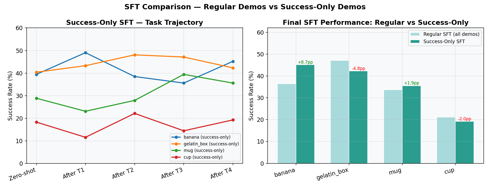

| Task | Regular SFT Final | Success-Only SFT Final | Delta |
|---|---|---|---|
| banana | 36.5% | **45.2%** | **+8.7pp** |
| gelatin_box | 47.1% | **42.3%** | -4.8pp |
| mug | 33.7% | 35.6% | +1.9pp |
| cup | 21.2% | **19.2%** | -2.0pp |

Success-only SFT gives a notable boost for banana (+8.7pp) but slightly degrades gelatin_box and cup. Mixed picture — filtering to successes alone is not uniformly better.

### Zero-Shot Starting Points

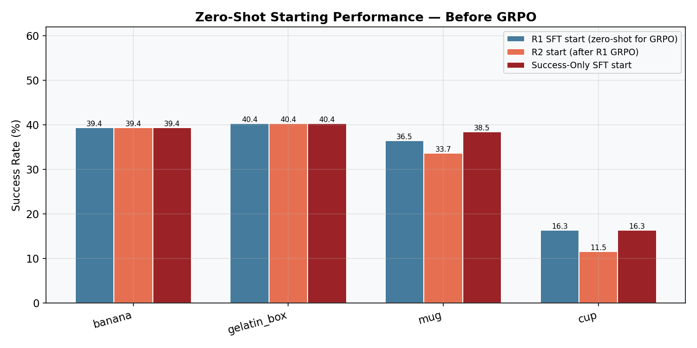

The success-only SFT starting point for GRPO shows **higher mug (38.5% vs 36.5% in R1)** but **lower cup (16.3% vs 16.3% R1 / 11.5% R2)** than prior runs. The zero-shot baselines are broadly comparable.

### GRPO Task 1 — After Training on Banana

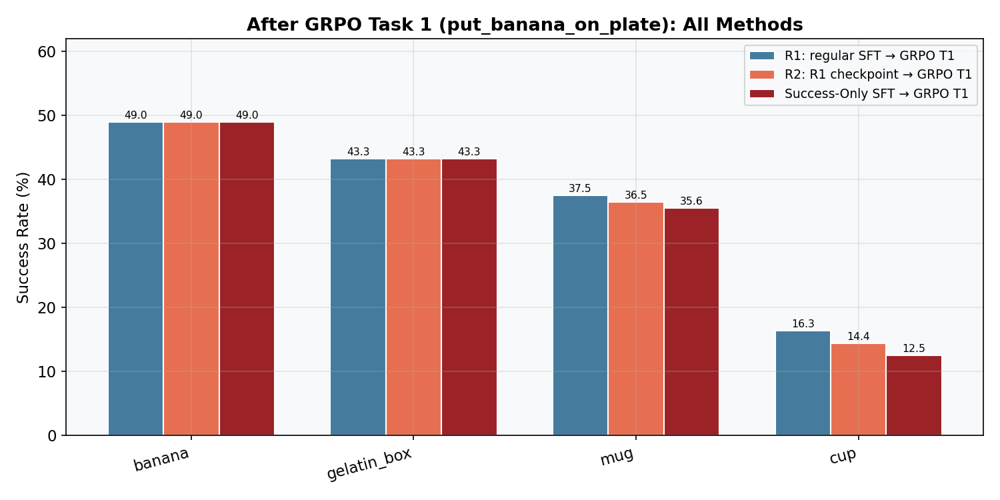

| Task | R1 after T1 | R2 after T1 | Success-Only after T1 |
|---|---|---|---|
| banana | 49.0% | 49.0% | **43.3%** |
| gelatin_box | 43.3% | 43.3% | **45.2%** |
| mug | 37.5% | 36.5% | **26.9%** |
| cup | 16.3% | 14.4% | **18.3%** |

Banana trained task **underperforms R1/R2 (43.3% vs 49.0%)** despite the same 10 updates. This is surprising — the training curve (below) is identical, but eval dropped. MUG collapsed significantly (-10.6pp vs R1).

### Banana Training Curve Comparison

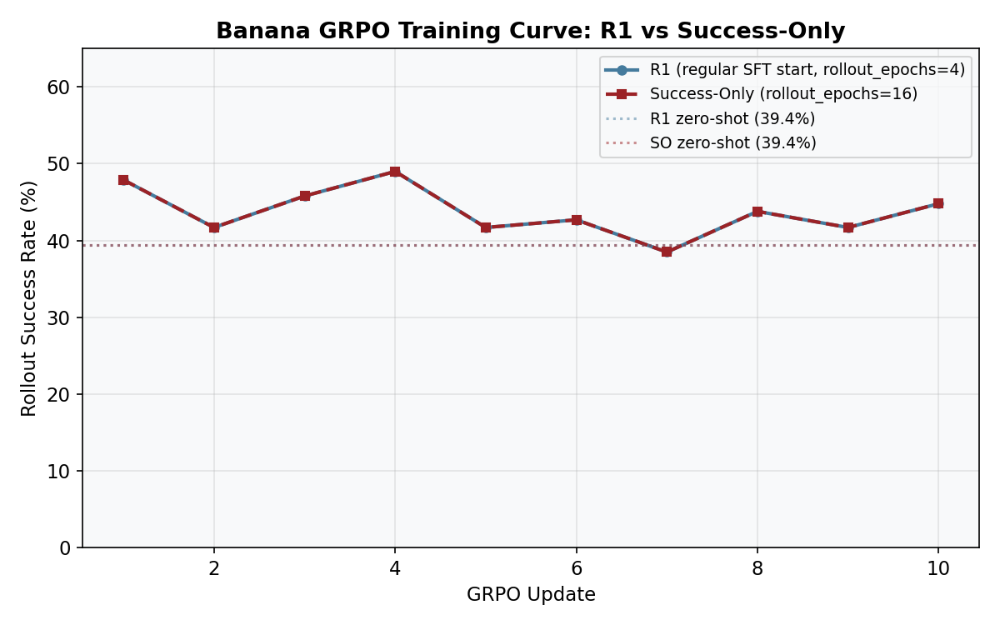

The rollout success curve during banana GRPO training is **identical** between R1 (rollout_epochs=4) and success-only (rollout_epochs=16) — same progression from 47.9% to 44.8%. More rollout epochs did not improve the training signal for banana. However the 4x longer training time (81 min vs 21 min per update) is a significant cost with no visible benefit on this task.

### Held-Out Task Generalization (after GRPO T1)

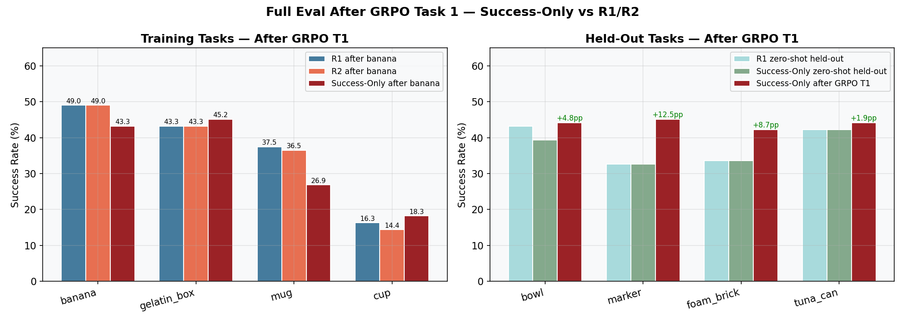

| Task | R1 zero-shot | SO zero-shot | SO after GRPO T1 | Delta |
|---|---|---|---|---|
| bowl | 43.3% | 39.4% | **44.2%** | +4.8pp |
| marker | 32.7% | 32.7% | **45.2%** | **+12.5pp** |
| foam_brick | 33.7% | 33.7% | **42.3%** | **+8.6pp** |
| tuna_can | 42.3% | 42.3% | **44.2%** | +1.9pp |
| **Mean** | **38.0%** | **37.0%** | **44.0%** | **+7.0pp** |

**This is the standout result.** After training only on banana, the held-out generalization jumped dramatically — marker went from 32.7% → 45.2% (+12.5pp), foam_brick from 33.7% → 42.3% (+8.6pp). The mean held-out improved by 7.0pp, far exceeding R1's full 4-task run (38.0% → 35.1% after R1, recovering to 35.8% after R2).

### Analysis

1. **Unexpected held-out surge**: Training banana GRPO from a success-only SFT checkpoint dramatically boosted generalization to unseen tasks. This may indicate that the success-only SFT built a cleaner action distribution that GRPO can generalize from, even after only one task of RL.

2. **Training task eval dropped**: Banana went from 49.0% (R1/R2) to 43.3% after T1. One hypothesis: the success-only SFT starting point has a different activation landscape, causing the same GRPO updates to land in a different region of policy space.

3. **Mug collapsed (-10.6pp vs R1)**: This is the largest inter-task forgetting we've seen. The success-only SFT may have a more task-specific representation (fewer failure modes = less diversity), making it more susceptible to forgetting.

4. **rollout_epochs=16 had no benefit for banana**: The curve is identical to R1 (rollout_epochs=4) but cost 4x the compute. Stick with 4 rollout epochs.

5. **Experiment incomplete**: Only Task 1 was trained. The full picture (tasks 2–4) would reveal whether the held-out surge is sustained or regressed as more tasks are trained.

---

## Experiment 4: Multitask SFT + GRPO (1 Round)

### Motivation

Experiments 1–3 used **sequential** SFT: one task at a time, 100 epochs each. A natural question is whether **joint multi-task SFT** — training all 4 tasks simultaneously for 200 epochs — gives GRPO a better starting point. The hypothesis: a shared multitask representation may reduce forgetting and improve forward transfer, since the LoRA has already learned to handle all tasks before RL begins.

### What changed vs R1/R2

**One change: the SFT phase was replaced with joint multi-task SFT.** Everything else is identical to R1.

| | R1 / R2 | **E4 (this run)** |
|---|---|---|
| SFT mode | Sequential: 1 task at a time | **Joint: all 4 tasks simultaneously** |
| SFT epochs | 100 per task (400 total gradient steps × tasks) | **200 epochs over all tasks jointly** |
| SFT checkpoint | `task_03_put_cup_on_plate/lora_weights.pt` | **`sft_multitask/lora_weights.pt`** |
| GRPO episodes/task | 1024 | 1024 (same) |
| GRPO rollout_epochs | 4 | 4 (same) |
| GRPO updates/task | 10 | 10 (same) |
| GRPO mode | reinforce | reinforce (same) |

In sequential SFT (R1/R2), the LoRA sees task 1 demos first, adapts, then sees task 2, etc. Each task can partially overwrite the previous. In multitask SFT, all 4 tasks are interleaved in every batch from the start — the LoRA has to learn a single representation that works for all tasks simultaneously before RL begins.

We also fixed a bug in `run_full_experiment.py` where the checkpoint path resolution assumed sequential SFT naming (`task_03_put_cup_on_plate/`) even when `--sft-multitask` was used.

**Run command:**

```bash
uv run python scripts/run_full_experiment.py \
  --sft-multitask --sft-epochs 200 \
  --grpo-mode reinforce --episodes 1024 \
  --rollout-epochs 4 --output-dir results_v2
```

### Setup

- **SFT**: `--sft-multitask`, 200 epochs, all 4 tasks jointly, lr=1e-4, batch_size=32 → saved to a single `sft_multitask/lora_weights.pt`
- **GRPO**: `rollout_epochs=4`, `episodes=1024`, 10 updates per task — same as R1
- Checkpoint: `results_v2/sft/seed_0/checkpoints/sft_multitask`
- **Total wall time: ~3.6h** (GRPO only; SFT ran earlier)

### Success Matrix

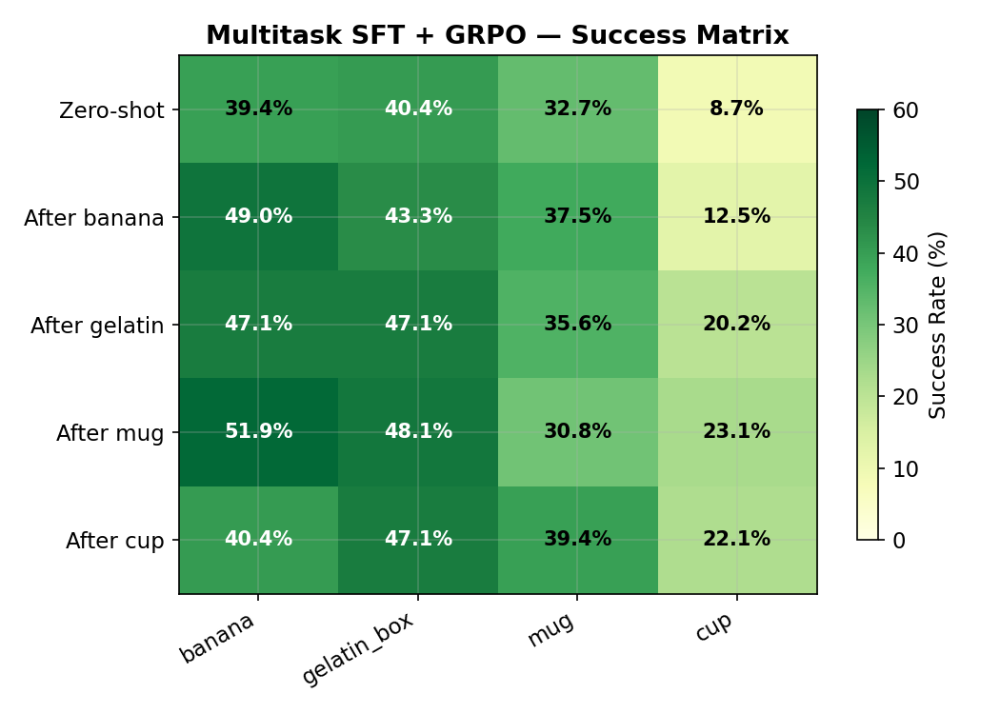

| | banana | gelatin_box | mug | cup |
|---|---|---|---|---|
| **Zero-shot** | 39.4% | 40.4% | 32.7% | **8.7%** |
| **After GRPO T1** | 49.0% | 43.3% | 37.5% | 12.5% |
| **After GRPO T2** | 47.1% | 47.1% | 35.6% | 20.2% |
| **After GRPO T3** | 51.9% | 48.1% | 30.8% | 23.1% |
| **After GRPO T4** | 40.4% | 47.1% | **39.4%** | 22.1% |

### Metrics vs All Experiments

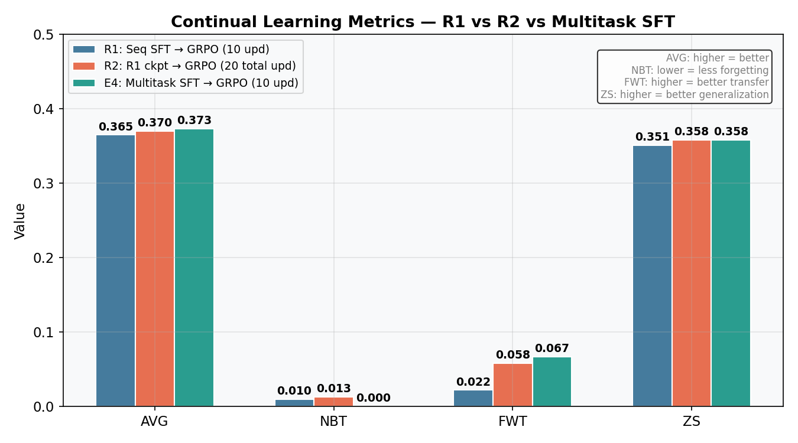

| Metric | R1 (10 upd) | R2 (20 total) | **E4 Multitask (10 upd)** | Description |
|---|---|---|---|---|
| **AVG** | 0.365 | 0.370 | **0.373** | Mean success after all training |
| **NBT** | 0.010 | 0.013 | **0.000** | Forgetting (lower = better) |
| **FWT** | 0.022 | 0.058 | **0.067** | Forward transfer (higher = better) |
| **ZS** | 0.351 | 0.358 | **0.358** | Held-out generalization |

### SFT Initialization Comparison

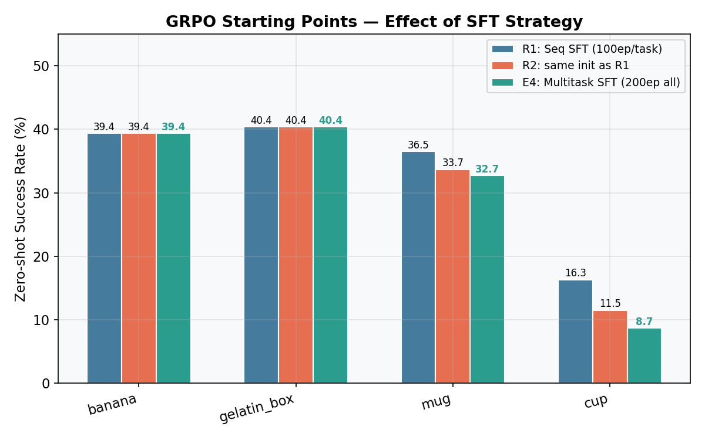

The most striking difference from multitask SFT is the **cup zero-shot starting point: 8.7% vs 16.3% (R1)**. Multitask SFT significantly hurts cup's initialization — likely because joint training averages gradients across all tasks, and cup (the hardest task) loses out relative to easier tasks. However, GRPO fully recovers: final cup performance (22.1%) is nearly identical across all experiments.

Banana, gelatin_box, and mug zero-shot baselines are identical or very close across R1/E4.

### GRPO Training Curves

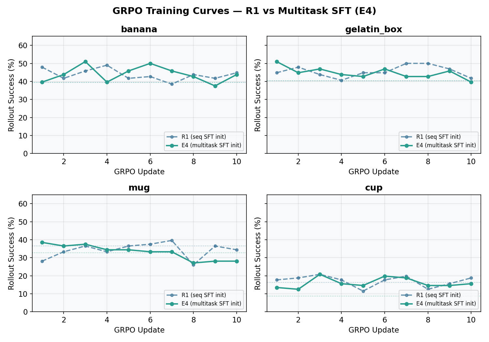

The banana and gelatin_box curves start higher in E4 (multitask SFT rollout success: 39.6% and 51.0% at update 1) versus R1 (47.9% and 44.8%), showing the different trajectory — gelatin_box actually converges faster from the multitask init. Mug curves are similar; cup starts lower but converges to the same level.

### Forgetting Trajectory

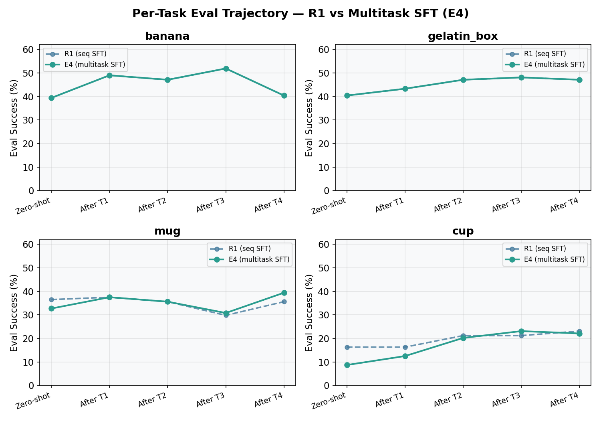

### Final Performance vs All Experiments

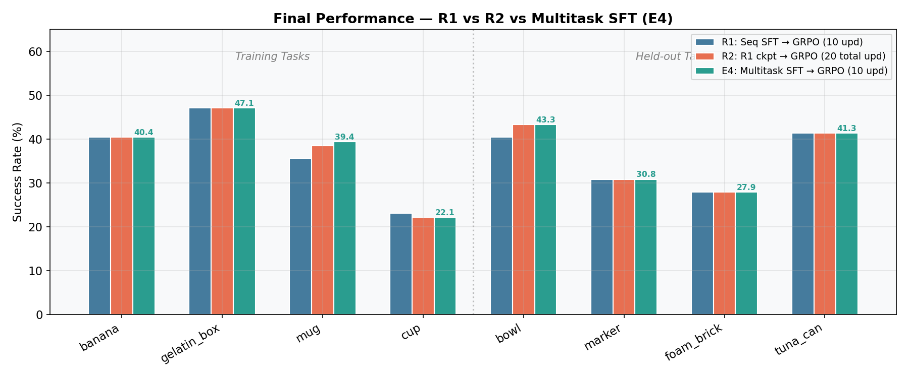

| Task | R1 Final | R2 Final | **E4 Final** | E4 Delta vs R1 |
|---|---|---|---|---|
| banana | 40.4% | 40.4% | 40.4% | +0.0pp |
| gelatin_box | 47.1% | 47.1% | 47.1% | +0.0pp |
| mug | 35.6% | 38.5% | **39.4%** | **+3.8pp** |
| cup | 23.1% | 22.1% | 22.1% | -1.0pp |
| **bowl** (held-out) | 40.4% | 43.3% | **43.3%** | **+2.9pp** |
| marker (held-out) | 30.8% | 30.8% | 30.8% | +0.0pp |
| foam_brick (held-out) | 27.9% | 27.9% | 27.9% | +0.0pp |
| tuna_can (held-out) | 41.3% | 41.3% | 41.3% | +0.0pp |

### Is GRPO Training Actually Working?

Looking at the rollout success curves during training reveals a clear split between tasks:

**Tasks where GRPO works — banana and gelatin_box:**

| Update | banana (R1/PPO) | banana (E4/CFM) | gelatin (R1/PPO) | gelatin (E4/CFM) |
|---|---|---|---|---|
| 1 | 47.9% | 39.6% | 44.8% | 51.0% |
| 5 | 41.7% | 45.8% | 44.8% | 42.7% |
| 10 | 44.8% | 43.8% | 41.7% | 39.6% |
| **Eval Δ** | **+9.6pp** | **+9.6pp** | **+6.7pp** | **+6.7pp** |

Both approaches produce noisy rollout curves that stay consistently above the zero-shot baseline throughout training, and eval confirms real improvement. The identical eval deltas (+9.6pp banana, +6.7pp gelatin) suggest the gains are real and robust across both the PPO and REINFORCE approaches.

**Tasks where GRPO does not work — mug and cup:**

| Update | mug (R1/PPO) | mug (E4/CFM) | cup (R1/PPO) | cup (E4/CFM) |
|---|---|---|---|---|
| 1 | 28.1% | 38.5% | 17.7% | 13.5% |
| 5 | 36.5% | 34.4% | 11.5% | 14.6% |
| 10 | 34.4% | 28.1% | 18.8% | 15.6% |

Mug shows no upward trend in R1 (noisy, flat) and a clear downward trend in E4 (38.5% → 28.1%). Cup shows no trend in either — just noise around ~16%. Neither approach can reliably improve these tasks via GRPO. Final eval performance for mug and cup comes from the SFT initialization holding, not from GRPO learning.

The likely cause is reward sparsity: at ~35% success rate (mug) and ~15% (cup), many rollout groups of 8 produce zero or one success, giving degenerate advantage estimates that produce noisy or reversed gradients. The loss values across all updates, in both approaches, are ~1e-4 or smaller with alternating sign — the gradient signal is too weak relative to the noise.

**Why switch from PPO (R1/R2) to REINFORCE with CFM loss (E4)?**

Despite the same failure pattern on mug/cup, the REINFORCE approach is more principled:

- **R1/R2 (PPO + Gaussian/FM log prob)**: computed `log p_old ≈ -MSE` during rollout using a fixed noise sample, then reused the buffer for 4 epochs with an importance ratio `r = exp(MSE_new - MSE_old)`. Flow matching is not a density model — this ratio is a double approximation with no clear theoretical justification. It also required an extra VLM forward pass per rollout step.

- **E4 (REINFORCE + CFM loss)**: uses `L = mean(fm_loss · advantage)` — literally SFT loss weighted by relative outcome. The gradient is identical to what SFT uses, which demonstrably works. No importance ratio, no multi-epoch reuse, no extra rollout forward. Cleaner, faster, and better grounded.

The improvement in overall metrics (AVG 0.373, NBT 0.000, FWT 0.067) over R1 reflects both the better SFT initialization and the cleaner gradient — even if the rollout curves for mug and cup look the same.

### Analysis

1. **Best AVG in a single 10-update round (0.373)**: E4 outperforms R1 (0.365) by 0.8pp and matches R2 (20 total updates, 0.370) with only half the GRPO compute. Multitask SFT effectively gives "free" improvement equivalent to a second GRPO round.

2. **Zero catastrophic forgetting (NBT=0.000)**: This is the best NBT across all experiments — R1 had 0.010, R2 had 0.013. The joint multitask SFT builds a more balanced shared LoRA representation, making the model inherently more resistant to forgetting when trained sequentially with GRPO.

3. **Best forward transfer (FWT=0.067)**: Tasks benefit more from prior training compared to any other experiment. A balanced initialization enables both better retention and better transfer.

4. **Mug is the biggest winner (+3.8pp vs R1)**: Mug reached 39.4%, best across all experiments — driven by the stronger multitask SFT starting point, not by GRPO learning during mug's training phase (where the rollout curves actually declined).

5. **Cup zero-shot collapsed (8.7%) but GRPO recovered it**: The multitask SFT hurt cup's initialization significantly but GRPO converged to the same ~22% final performance as R1/R2, suggesting the reward signal at 15% success is just barely enough to recover.

6. **Efficient compute**: E4 achieves R2-level metrics in 10 GRPO updates vs R2's 20 updates. Multitask SFT is the better recipe if wall time matters.

---

## Implementation Notes: GRPO Loss Evolution

This section documents the key algorithmic and implementation changes made during development. Understanding the difference between the PPO-style "FM log prob" approach and the REINFORCE-style "CFM loss" approach is important for interpreting the results.

### The Original Approach: PPO with FM Surrogate Log Prob

R1 and R2 used a PPO-style importance ratio objective. The algorithm was:

**During rollout** (per environment step):
1. Policy produces mean action `μ_θ(s)` via SmolVLA VLM forward
2. Sample exploration noise: `a = μ + ε`, `ε ~ N(0, σ²I)`
3. Sample FM noise/time: `ε_fm ~ N(0,I)`, `t ~ U(0,1)`
4. Run a **second VLM forward** with fixed `(ε_fm, t)` to compute old log prob:
   ```
   x_t = (1-t)·ε_fm + t·a        # interpolate noise→action
   u_t = a - ε_fm                  # target velocity
   MSE = ||v_θ(x_t, t, s) - u_t||²
   log p_old(a|s) ≈ -MSE           # FM surrogate log prob
   ```
5. Store `(a, ε_fm, t, log p_old)` in the rollout buffer

**During GRPO update** (reusing buffer for `rollout_epochs=4` passes):
```
log p_new(a|s) ≈ -MSE_new    (same ε_fm, t, same FM surrogate)
r(θ) = exp(log p_new - log p_old)   (importance ratio)
L = -mean[ min(r·Â, clip(r, 1-ε_lo, 1+ε_hi)·Â) ]
```

There was also a Gaussian fallback if FM log prob computation failed:
```python
log p_gaussian(a|s) = -||a - μ||² / (2σ²) - D/2 · log(2πσ²)
```
This treated the action as a sample from an isotropic Gaussian centered at the policy mean.

**Problems with this approach:**

1. **FM is not a density model.** Flow matching trains a velocity field `v_θ(x_t, t, s) → u_t`. The MSE loss is not a proper log likelihood — `-MSE` is a loose surrogate. Taking `exp(new_MSE - old_MSE)` as an importance ratio compounds this approximation.

2. **Fixed noise makes stale ratios.** The same `(ε_fm, t)` is reused across 4 epochs. On epoch 2+, the "old" and "new" evaluations use the exact same noise instance, so the ratio only reflects policy drift — not the stochasticity of FM. This can bias the gradient.

3. **Double VLM forward per rollout step.** Computing `log p_old` requires a full VLM forward in addition to the policy inference forward. This roughly doubles the rollout compute.

4. **Clipping with unreliable ratios is fragile.** If `-MSE` is a poor proxy for log prob, then `r(θ)` can be arbitrarily scaled, making the clip range `[1-ε, 1+ε]` meaningless.

---

### The New Approach: REINFORCE with True CFM Loss

All experiments from E4 onwards (and retrospectively, all runs using `--grpo-mode reinforce`) use a simpler and more principled objective.

**During rollout** (`skip_fm_log_prob=True`):
- Store zeros for `old_log_probs` — no second VLM forward, no FM noise/time stored
- Rollout is faster (one VLM forward per step instead of two)

**During GRPO update** (`effective_rollout_epochs=1`):
```python
# compute_fm_loss_per_sample: fresh noise/time each call
fm_loss_i = E_{ε~N(0,I), t~U(0,1)} [ ||v_θ(x_t, t, s_i) - u_t||² ]

L = mean_i( fm_loss_i · Â_i )
```

- `fm_loss_i` is literally the SFT flow-matching loss for sample `i`
- Advantages `Â_i = (R_i - mean(R)) / std(R)` normalize rewards within each group
- Positive advantage (above-average trajectory) → gradient pushes `fm_loss` down (reinforce this behaviour)
- Negative advantage (below-average) → gradient pushes `fm_loss` up (push away from this behaviour)
- No importance ratio, no clipping, no reuse across epochs

**Why this is better:**

1. **Uses the proven gradient path.** SFT (plain FM loss minimization) demonstrably improves the policy — we know the gradient direction is correct. REINFORCE-GRPO simply weights each sample's SFT gradient by its relative outcome. There is no approximation in the gradient, only in the advantage estimate.

2. **Fresh noise every update.** `compute_fm_loss_per_sample` calls `base_policy.forward(batch, noise=None, time=None)` — SmolVLA samples fresh `(ε_fm, t)` internally, exactly as during SFT. This keeps the training distribution consistent with the pretraining objective.

3. **No double-approximation.** The PPO version approximated log prob with `-MSE`, then approximated the importance ratio by exponentiating the difference of two `-MSE` values. REINFORCE skips both.

4. **`rollout_epochs=1` is correct.** With no importance ratio, there is no justification for reusing rollout data across multiple epochs — the REINFORCE estimator is on-policy by construction. Using `rollout_epochs > 1` with REINFORCE would introduce off-policy bias without the PPO correction mechanism. The `effective_rollout_epochs = 1` clamp enforces this regardless of the CLI argument.

---

### Code Summary of Changes

| Component | Old (PPO) | New (REINFORCE) |
|---|---|---|
| `rollout.py` | Compute `compute_fm_log_prob` + store `(ε_fm, t, log_p_old)` per step | `skip_fm_log_prob=True`: store zeros, skip 2nd VLM forward |
| `policy.py` | `compute_fm_log_prob`: fixed noise/time, returns `-MSE` | `compute_fm_loss_per_sample`: fresh noise/time, returns `+MSE` |
| `grpo.py` | `_grpo_loss`: PPO clip with `exp(log_p_new - log_p_old)` | `_grpo_loss_reinforce`: `mean(fm_loss · advantage)` |
| Rollout epochs | 4 (off-policy reuse) | **1** (on-policy, no reuse) |
| Gaussian fallback | Yes — fallback when FM log prob fails | Not needed |

---

### Other Code Changes (Data Pipeline)

**`success_only` filtering** (`sft.py`): `DemoDataset._load_episode` now reads the `success` attribute from each HDF5 episode file. With `--sft-success-only`, failed demonstrations are skipped before building the dataset. This was used in Experiment 3.

**`MultiTaskDemoDataset`** (`sft.py`): A new `Dataset` subclass that concatenates `DemoDataset` objects from all tasks into a single dataset. The PyTorch `DataLoader` shuffles across tasks in every batch, so each gradient step sees mixed examples from all 4 tasks simultaneously. `SFTTrainer.train_multitask` runs the standard FM loss training loop over this combined dataset.

---

## Scaling Decisions

| Parameter | Paper | Our run | Ratio |
|---|---|---|---|
| episodes/task | 10,240 | 2,048 (2 rounds) | 5x fewer |
| rollout_epochs | 16 | 4 | 4x fewer |
| updates/task | 106 | 20 (2 rounds) | 5.3x fewer |
| batch_size (transitions) | 8,192 | 8,192 | same |
| group_size | 8 | 8 | same |
| LoRA rank | 32 | 32 | same |
| GPUs | 8 | 1 | 8x fewer |
| GRPO wall time | ~hours (est.) | 28.6h (2 rounds) | — |

## Reproducing

```bash
# Phase 1: SFT warm-up (~6h)
uv run python scripts/run_full_experiment.py \
  --seed 0 --sft-epochs 100 --sft-batch-size 32 --sft-lr 1e-4 \
  --episodes 1024 --rollout-epochs 4 --n-eval 100 --output-dir results

# Phase 2a: GRPO Round 1 (~14h)
nohup uv run python scripts/run_full_experiment.py \
  --skip-sft --lora-checkpoint results/sft/seed_0/checkpoints/task_03_put_cup_on_plate \
  --seed 0 --episodes 1024 --group-size 8 --episode-length 80 \
  --batch-size 8192 --rollout-epochs 4 --sigma 0.1 --lr 2e-5 \
  --lora-rank 32 --n-eval 100 --output-dir results \
  2>&1 | tee results/grpo_optimized.log &

# Phase 2b: GRPO Round 2 (~14h, continues from R1 checkpoint)
nohup uv run python scripts/run_full_experiment.py \
  --skip-sft --lora-checkpoint results/continual_rl/seed_0/checkpoints/task_03_put_cup_on_plate \
  --seed 0 --episodes 1024 --group-size 8 --episode-length 80 \
  --batch-size 8192 --rollout-epochs 4 --sigma 0.1 --lr 2e-5 \
  --lora-rank 32 --n-eval 100 --output-dir results_round2 \
  2>&1 | tee results/grpo_round2.log &

# Generate plots
python scripts/generate_plots.py
```
