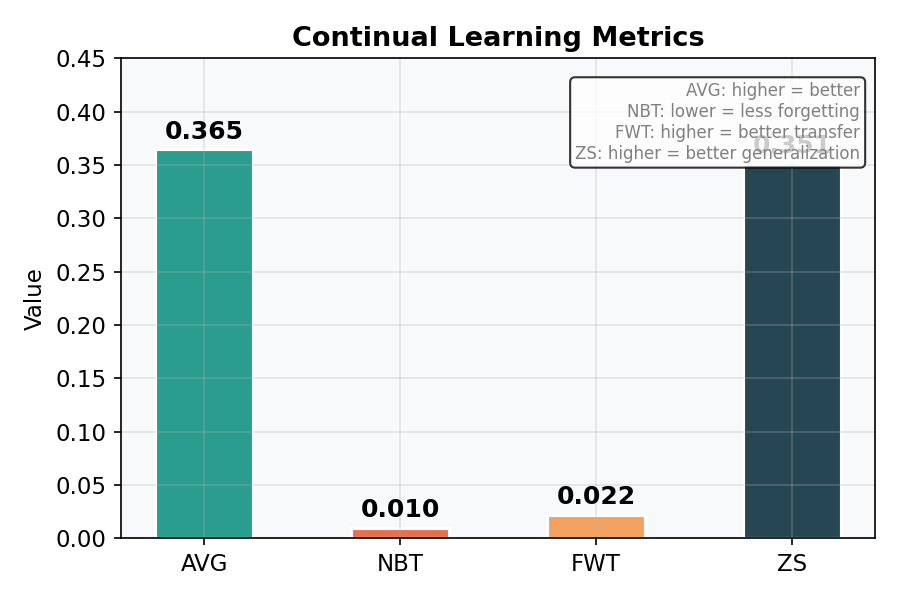
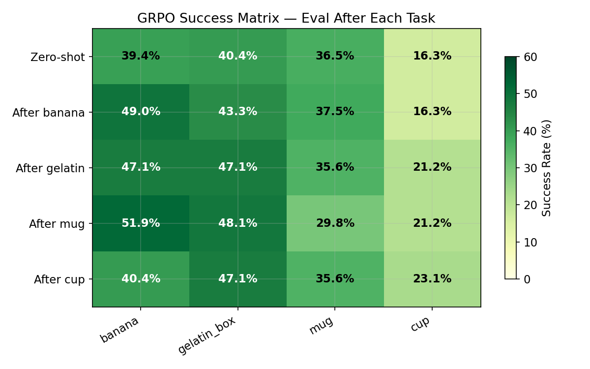
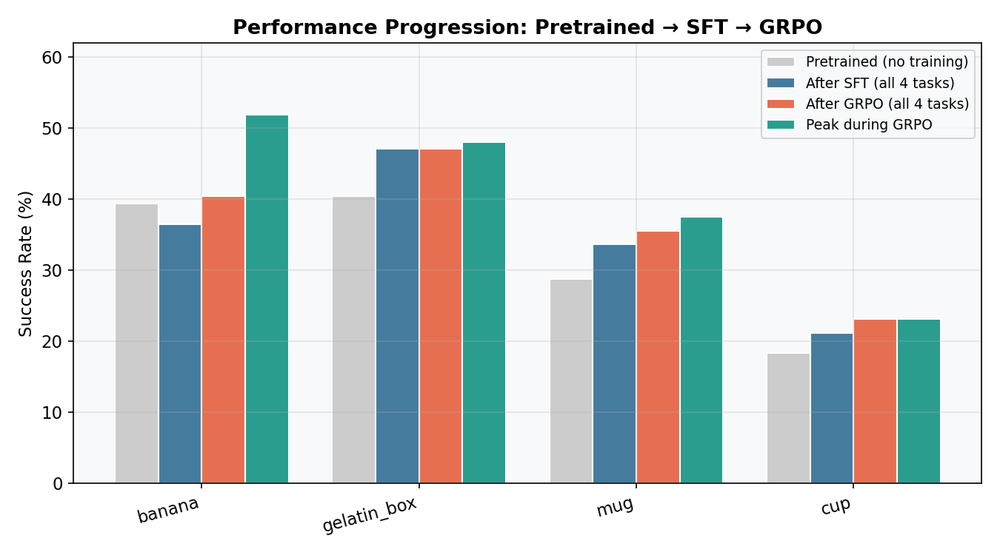
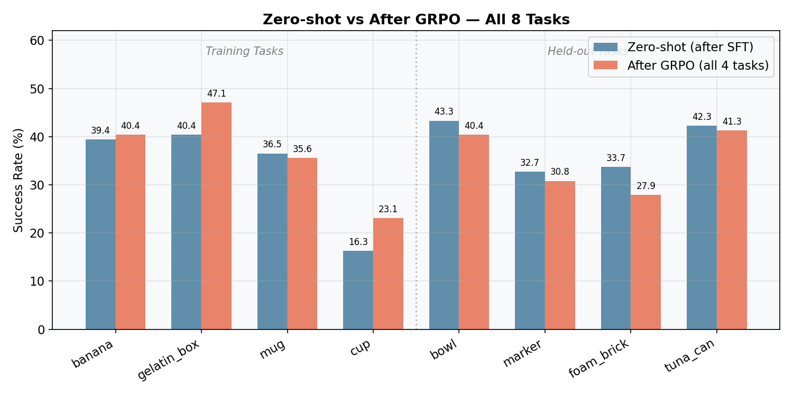
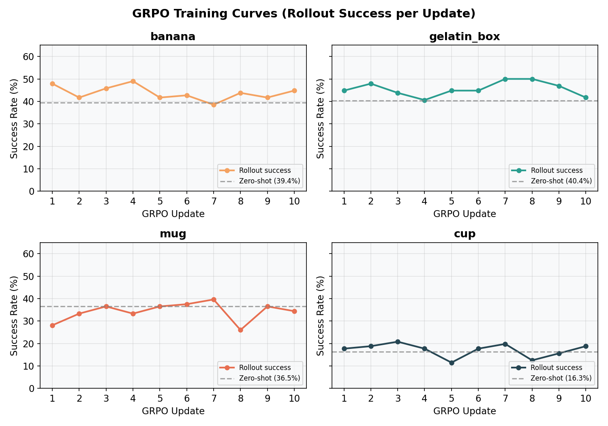
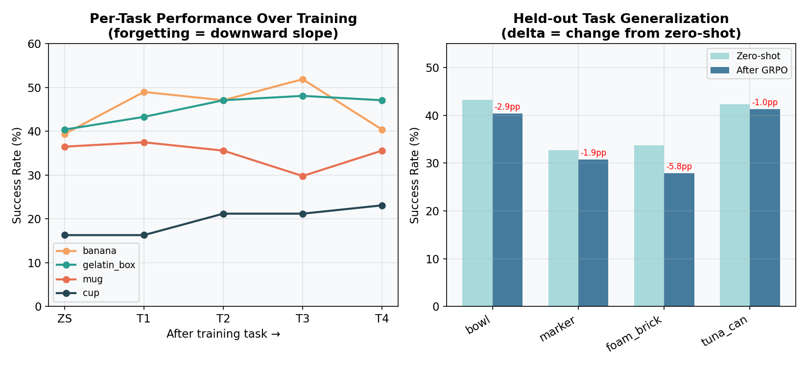

# Continual VLA RL: Reproducing "A Simple Recipe Works" with SmolVLA

## Overview

We implement the continual reinforcement learning pipeline from [A Simple Recipe Works (arXiv:2603.11653)](https://arxiv.org/abs/2603.11653) using **SmolVLA** (500M params) on a simulated SO-100 robot arm in ManiSkill/SAPIEN.

**Recipe**: Pretrained VLA + LoRA (rank 32) + Sequential GRPO. No replay buffer, no regularization.

## Setup

- **Model**: SmolVLA (SmolVLM2-500M backbone + flow-matching action head), 17.3M / 467M trainable params (3.70% via LoRA)
- **Robot**: SO-100 6-DOF arm, simulated in SAPIEN with GPU backend
- **Tasks**: 8 "put X on plate" tasks (4 training, 4 held-out)
- **Demos**: 35 per task, 140 total (matching paper's demo count)
- **Hardware**: 1x NVIDIA RTX 4090 (24GB)

## Pipeline

### Phase 1: SFT Warm-up (5.9h)

Sequential supervised fine-tuning on all 4 training tasks using flow-matching loss.

- 100 epochs per task, lr=1e-4, batch_size=32 (micro_batch=4, accum=8)
- Uses `base_policy.forward()` for differentiable FM loss

### Phase 2: Sequential GRPO (14.3h)

On-policy RL with Group Relative Policy Optimization on the same 4 tasks sequentially.

- Flow-matching GRPO: `log p(a|s) ~ -E_t[||v_theta(x_t,t,s) - u_t||^2]`
- Clipped objective with asymmetric clip (0.20, 0.28)
- 1,024 episodes/task, 4 rollout epochs, 10 updates/task, ~21 min/update

**Total wall time: ~20h** (SFT + GRPO)

## Results

### Final Metrics



| Metric | Value | Description |
|---|---|---|
| **AVG** | **36.5%** | Mean success across all tasks after training |
| **NBT** | **0.010** | Negative backward transfer (forgetting) — lower is better |
| **FWT** | **0.022** | Forward transfer — higher is better |
| **ZS** | **35.1%** | Held-out zero-shot generalization |

### Success Matrix (GRPO Phase)



Rows = policy state, columns = evaluation task. "Zero-shot" = after SFT warm-up, before any GRPO.

| | banana | gelatin_box | mug | cup |
|---|---|---|---|---|
| **Zero-shot** | 39.4% | 40.4% | 36.5% | 16.3% |
| **After GRPO task 1** (banana) | **49.0%** | 43.3% | 37.5% | 16.3% |
| **After GRPO task 2** (gelatin) | 47.1% | **47.1%** | 35.6% | 21.2% |
| **After GRPO task 3** (mug) | 51.9% | 48.1% | 29.8% | 21.2% |
| **After GRPO task 4** (cup) | 40.4% | 47.1% | 35.6% | **23.1%** |

### Performance Progression: Pretrained → SFT → GRPO



### Zero-shot vs After GRPO — All 8 Tasks



### GRPO Training Curves



Per-update rollout success rates during GRPO training. Dashed line = zero-shot baseline (after SFT). All tasks show improvement above baseline, with banana and gelatin_box showing the strongest gains.

### Forgetting and Generalization



**Left**: Per-task eval performance as training progresses through tasks. Flat or rising lines = no forgetting. **Right**: Held-out task performance before and after GRPO, with delta annotations.

### Held-out Tasks

| Task | Zero-shot | After all GRPO | Delta |
|---|---|---|---|
| put_bowl_on_plate | 43.3% | 40.4% | -2.9pp |
| put_marker_on_plate | 32.7% | 30.8% | -1.9pp |
| put_foam_brick_on_plate | 33.7% | 27.9% | -5.8pp |
| put_tuna_can_on_plate | 42.3% | 41.3% | -1.0pp |
| **Mean** | **38.0%** | **35.1%** | **-2.9pp** |

## Analysis

### The simple recipe works — with caveats

1. **GRPO drives real improvement**: Every task improves over the SFT baseline during its GRPO phase. Banana reaches 49.0% (from 39.4%), gelatin_box reaches 47.1% (from 40.4%), cup reaches 23.1% (from 16.3%).

2. **Remarkably low forgetting (NBT=0.010)**: After training on all 4 tasks sequentially with no replay buffer and no regularization, previous tasks retain most of their performance. Banana ends at 40.4% — essentially unchanged from zero-shot (39.4%) despite 3 subsequent tasks. This validates the paper's core finding that LoRA + GRPO naturally resists catastrophic forgetting.

3. **Positive forward transfer (FWT=0.022)**: Tasks trained later benefit from earlier GRPO training. Cup improves from 16.3% to 21.2% after gelatin_box GRPO (before cup is trained), and mug goes 36.5% → 37.5% after banana GRPO.

4. **Cross-task synergy after task 3**: Banana actually reaches its highest eval score (51.9%) after mug GRPO — better than after its own GRPO phase (49.0%). This suggests GRPO on related tasks can improve previously learned ones.

5. **Cup is the hardest task**: Starts at 16.3% and only reaches 23.1% — the most difficult manipulation geometry. Limited improvement suggests 10 GRPO updates may not be enough for harder tasks.

6. **Held-out tasks degrade slightly (-2.9pp)**: Training specializes the model toward training tasks at a small cost to generalization. Foam_brick takes the largest hit (-5.8pp).

7. **High variance in rollout success**: Per-update success fluctuates significantly (e.g., mug swings between 26.0% and 39.6%). On-policy RL with small groups (8 episodes) produces noisy estimates — the paper's larger batch size (8192 transitions vs our 960) would smooth this.

### SFT Phase Results (for reference)

| Task | Zero-shot | After SFT 1 | After SFT 2 | After SFT 3 | After SFT 4 |
|---|---|---|---|---|---|
| banana | 39.4% | 47.1% | 38.5% | 48.1% | 36.5% |
| gelatin_box | 40.4% | 46.2% | 50.0% | 44.2% | 47.1% |
| mug | 28.8% | 32.7% | 28.8% | 33.7% | 33.7% |
| cup | 18.3% | 21.2% | 26.0% | 23.1% | 21.2% |

## Scaling Decisions

| Parameter | Paper | Our run | Ratio |
|---|---|---|---|
| episodes/task | 10,240 | 1,024 | 10x fewer |
| rollout_epochs | 16 | 4 | 4x fewer |
| updates/task | 106 | 10 | 10.6x fewer |
| batch_size (transitions) | 8,192 | 8,192 | same |
| group_size | 8 | 8 | same |
| LoRA rank | 32 | 32 | same |
| GPUs | 8 | 1 | 8x fewer |
| GRPO wall time | ~hours (est.) | 14.3h | — |

The bottleneck is `rollout_epochs`: each epoch requires a full VLM forward+backward pass over all transitions. With 16 epochs, each update takes ~83 min. Reducing to 4 epochs cuts this to ~21 min/update.

## Reproducing

```bash
# Phase 1: SFT warm-up (~6h)
uv run python scripts/run_full_experiment.py \
  --seed 0 --sft-epochs 100 --sft-batch-size 32 --sft-lr 1e-4 \
  --episodes 1024 --rollout-epochs 4 --n-eval 100 --output-dir results

# Phase 2 only (skip SFT, ~14h)
nohup uv run python scripts/run_full_experiment.py \
  --skip-sft --lora-checkpoint results/sft/seed_0/checkpoints/task_03_put_cup_on_plate \
  --seed 0 --episodes 1024 --group-size 8 --episode-length 80 \
  --batch-size 8192 --rollout-epochs 4 --sigma 0.1 --lr 2e-5 \
  --lora-rank 32 --n-eval 100 --output-dir results \
  2>&1 | tee results/grpo_optimized.log &

# Generate plots
python scripts/generate_plots.py
```
