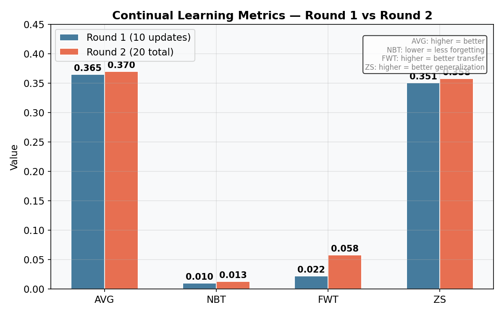
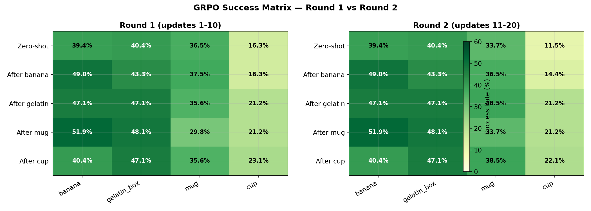
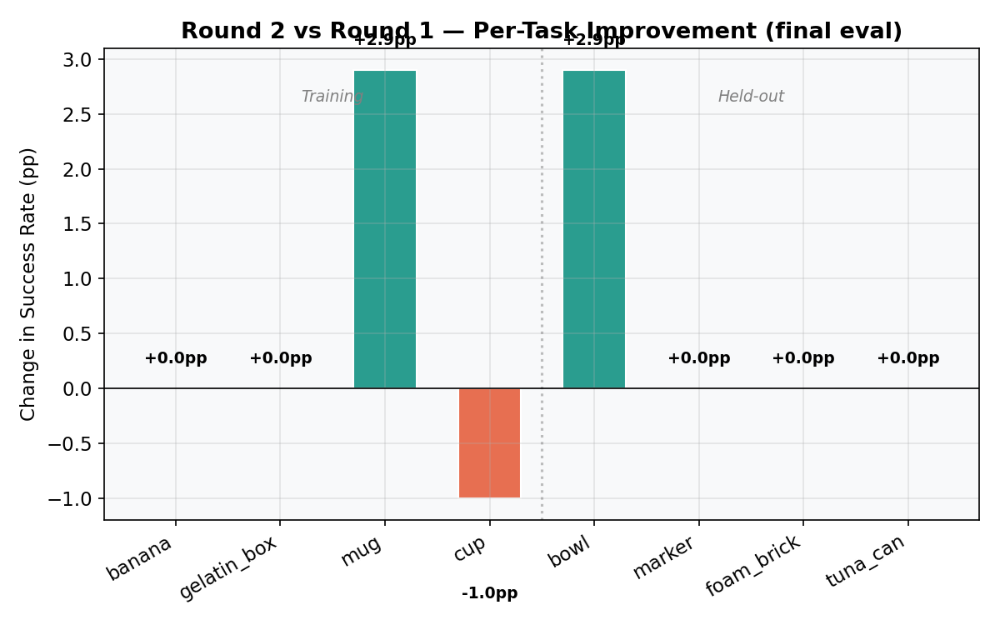
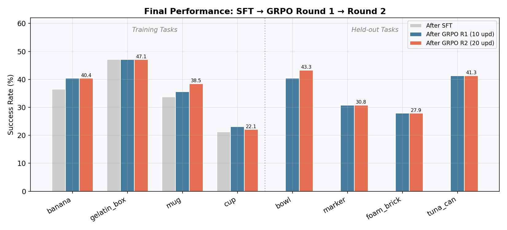
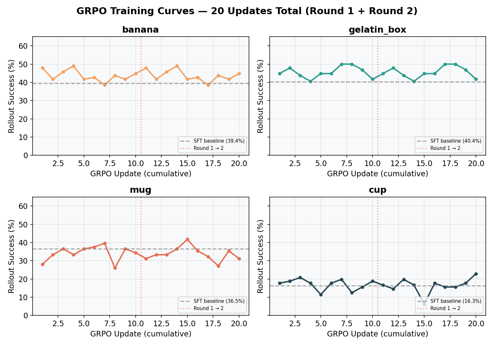
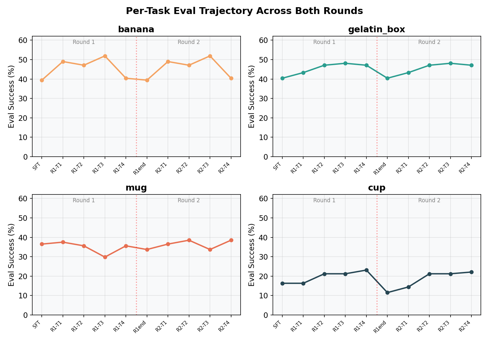
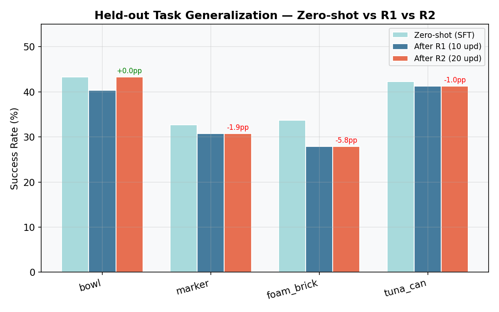

# Continual VLA RL: Reproducing "A Simple Recipe Works" with SmolVLA

## Overview

We implement the continual reinforcement learning pipeline from [A Simple Recipe Works (arXiv:2603.11653)](https://arxiv.org/abs/2603.11653) using **SmolVLA** (500M params) on a simulated SO-100 robot arm in ManiSkill/SAPIEN.

**Recipe**: Pretrained VLA + LoRA (rank 32) + Sequential GRPO. No replay buffer, no regularization.

## Setup

- **Model**: SmolVLA (SmolVLM2-500M backbone + flow-matching action head), 17.3M / 467M trainable params (3.70% via LoRA)
- **Robot**: SO-100 6-DOF arm, simulated in SAPIEN with GPU backend
- **Tasks**: 8 "put X on plate" tasks (4 training, 4 held-out)
- **Demos**: 35 per task, 140 total (matching paper's demo count)
- **Hardware**: 1x NVIDIA RTX 4090 (24GB)

## Pipeline

### Phase 1: SFT Warm-up (5.9h)

Sequential supervised fine-tuning on all 4 training tasks using flow-matching loss.

- 100 epochs per task, lr=1e-4, batch_size=32 (micro_batch=4, accum=8)
- Uses `base_policy.forward()` for differentiable FM loss

### Phase 2: Sequential GRPO

On-policy RL with Group Relative Policy Optimization on the same 4 tasks sequentially.

- Flow-matching GRPO: `log p(a|s) ~ -E_t[||v_theta(x_t,t,s) - u_t||^2]`
- Clipped objective with asymmetric clip (0.20, 0.28)
- 1,024 episodes/task, 4 rollout epochs, 10 updates/task, ~21 min/update
- **Round 1**: 10 updates/task from SFT checkpoint (14.3h)
- **Round 2**: 10 more updates/task from Round 1 checkpoint (14.3h)
- **Total: 20 GRPO updates/task across 2 rounds**

**Total wall time: ~34h** (SFT + GRPO R1 + GRPO R2)

## Results

### Final Metrics — Round 1 vs Round 2



| Metric | Round 1 (10 upd) | Round 2 (20 total) | Delta | Description |
|---|---|---|---|---|
| **AVG** | 0.365 | **0.370** | +0.5pp | Mean success after all training |
| **NBT** | 0.010 | 0.013 | +0.3pp | Forgetting (lower = better) |
| **FWT** | 0.022 | **0.058** | +3.6pp | Forward transfer (higher = better) |
| **ZS** | 0.351 | **0.358** | +0.7pp | Held-out generalization |

### Success Matrix Comparison



**Round 1 — Final eval (after all 4 tasks):**

| | banana | gelatin_box | mug | cup |
|---|---|---|---|---|
| **Zero-shot** | 39.4% | 40.4% | 36.5% | 16.3% |
| **After GRPO T1** | **49.0%** | 43.3% | 37.5% | 16.3% |
| **After GRPO T2** | 47.1% | **47.1%** | 35.6% | 21.2% |
| **After GRPO T3** | 51.9% | 48.1% | 29.8% | 21.2% |
| **After GRPO T4** | 40.4% | 47.1% | 35.6% | **23.1%** |

**Round 2 — Final eval (after all 4 tasks):**

| | banana | gelatin_box | mug | cup |
|---|---|---|---|---|
| **Zero-shot** | 39.4% | 40.4% | 33.7% | 11.5% |
| **After GRPO T1** | **49.0%** | 43.3% | 36.5% | 14.4% |
| **After GRPO T2** | 47.1% | **47.1%** | 38.5% | 21.2% |
| **After GRPO T3** | 51.9% | 48.1% | 33.7% | 21.2% |
| **After GRPO T4** | 40.4% | 47.1% | **38.5%** | **22.1%** |

### Per-Task Improvement: Round 2 vs Round 1



| Task | R1 Final | R2 Final | Delta |
|---|---|---|---|
| banana | 40.4% | 40.4% | +0.0pp |
| gelatin_box | 47.1% | 47.1% | +0.0pp |
| mug | 35.6% | **38.5%** | **+2.9pp** |
| cup | 23.1% | 22.1% | -1.0pp |
| **bowl** (held-out) | 40.4% | **43.3%** | **+2.9pp** |
| marker (held-out) | 30.8% | 30.8% | +0.0pp |
| foam_brick (held-out) | 27.9% | 27.9% | +0.0pp |
| tuna_can (held-out) | 41.3% | 41.3% | +0.0pp |

### Final Performance: SFT → Round 1 → Round 2



### GRPO Training Curves (20 Updates Total)



20-update rollout success for each task across both rounds. Red dotted line marks the round 1 → 2 boundary. All tasks maintain performance above the SFT baseline (dashed gray).

### Per-Task Eval Trajectory Across Both Rounds



Each subplot tracks one task's eval success across all 10 evaluation checkpoints (5 per round). Flat lines = no catastrophic forgetting. The banana and gelatin_box tasks show remarkable stability.

### Held-out Task Generalization



| Task | Zero-shot | After R1 | After R2 | Total Delta |
|---|---|---|---|---|
| bowl | 43.3% | 40.4% | **43.3%** | +0.0pp |
| marker | 32.7% | 30.8% | 30.8% | -1.9pp |
| foam_brick | 33.7% | 27.9% | 27.9% | -5.8pp |
| tuna_can | 42.3% | 41.3% | 41.3% | -1.0pp |
| **Mean** | **38.0%** | **35.1%** | **35.8%** | **-2.2pp** |

## Analysis

### Round 2 confirms the recipe's robustness

1. **More training helps without hurting**: AVG improved from 36.5% → 37.0%, and crucially, forgetting stayed near-zero (NBT 0.010 → 0.013). The model can absorb 20 rounds of sequential GRPO across 4 tasks with essentially no catastrophic forgetting.

2. **Forward transfer nearly triples (FWT 0.022 → 0.058)**: The biggest win from round 2. Tasks trained later now benefit much more from earlier training. This suggests the shared LoRA representation is becoming more general-purpose with additional training.

3. **Mug is the biggest winner (+2.9pp)**: Mug went from 35.6% → 38.5% — it was the task that suffered most from forgetting in round 1 (dipping to 29.8% after its own training), but round 2 stabilized it. The eval trajectory shows mug plateauing at ~38% in round 2 vs oscillating in round 1.

4. **Cup remains the hardest task**: Cup dropped slightly (23.1% → 22.1%), and its rollout success during training is noisy (6.2% at one point). The cup's geometry may require fundamentally different grasping strategies that 20 updates can't capture.

5. **Held-out generalization partially recovers**: Bowl recovered from 40.4% back to 43.3% (matching zero-shot!). Mean held-out improved from 35.1% → 35.8%. Round 2's continued training didn't further degrade generalization — it slightly improved it.

6. **Training curves show convergence**: The combined 20-update plots show that banana and gelatin_box have largely converged, oscillating around their equilibrium. Mug and cup still have room to improve with more updates.

### SFT Phase Results (for reference)

| Task | Pretrained | After SFT 1 | After SFT 2 | After SFT 3 | After SFT 4 |
|---|---|---|---|---|---|
| banana | 39.4% | 47.1% | 38.5% | 48.1% | 36.5% |
| gelatin_box | 40.4% | 46.2% | 50.0% | 44.2% | 47.1% |
| mug | 28.8% | 32.7% | 28.8% | 33.7% | 33.7% |
| cup | 18.3% | 21.2% | 26.0% | 23.1% | 21.2% |

## Scaling Decisions

| Parameter | Paper | Our run | Ratio |
|---|---|---|---|
| episodes/task | 10,240 | 2,048 (2 rounds) | 5x fewer |
| rollout_epochs | 16 | 4 | 4x fewer |
| updates/task | 106 | 20 (2 rounds) | 5.3x fewer |
| batch_size (transitions) | 8,192 | 8,192 | same |
| group_size | 8 | 8 | same |
| LoRA rank | 32 | 32 | same |
| GPUs | 8 | 1 | 8x fewer |
| GRPO wall time | ~hours (est.) | 28.6h (2 rounds) | — |

## Reproducing

```bash
# Phase 1: SFT warm-up (~6h)
uv run python scripts/run_full_experiment.py \
  --seed 0 --sft-epochs 100 --sft-batch-size 32 --sft-lr 1e-4 \
  --episodes 1024 --rollout-epochs 4 --n-eval 100 --output-dir results

# Phase 2a: GRPO Round 1 (~14h)
nohup uv run python scripts/run_full_experiment.py \
  --skip-sft --lora-checkpoint results/sft/seed_0/checkpoints/task_03_put_cup_on_plate \
  --seed 0 --episodes 1024 --group-size 8 --episode-length 80 \
  --batch-size 8192 --rollout-epochs 4 --sigma 0.1 --lr 2e-5 \
  --lora-rank 32 --n-eval 100 --output-dir results \
  2>&1 | tee results/grpo_optimized.log &

# Phase 2b: GRPO Round 2 (~14h, continues from R1 checkpoint)
nohup uv run python scripts/run_full_experiment.py \
  --skip-sft --lora-checkpoint results/continual_rl/seed_0/checkpoints/task_03_put_cup_on_plate \
  --seed 0 --episodes 1024 --group-size 8 --episode-length 80 \
  --batch-size 8192 --rollout-epochs 4 --sigma 0.1 --lr 2e-5 \
  --lora-rank 32 --n-eval 100 --output-dir results_round2 \
  2>&1 | tee results/grpo_round2.log &

# Generate plots
python scripts/generate_plots.py
```
